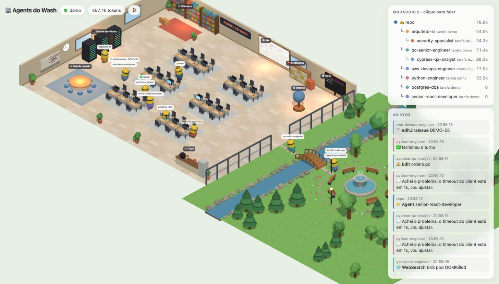
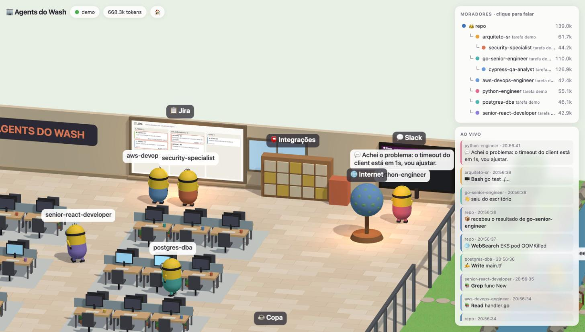
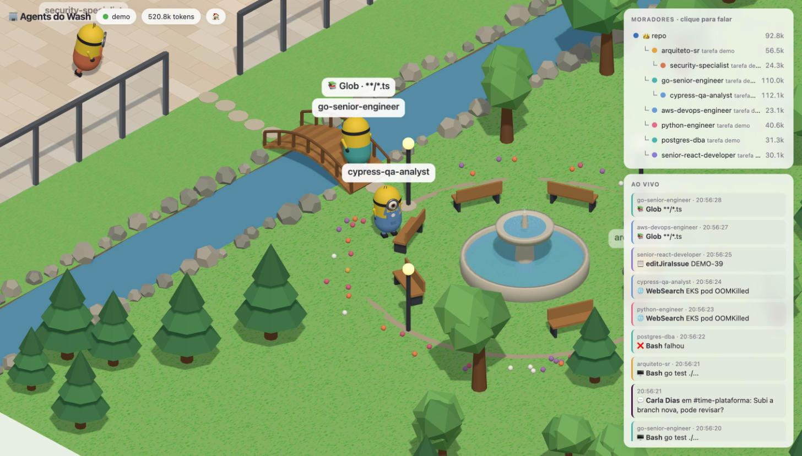
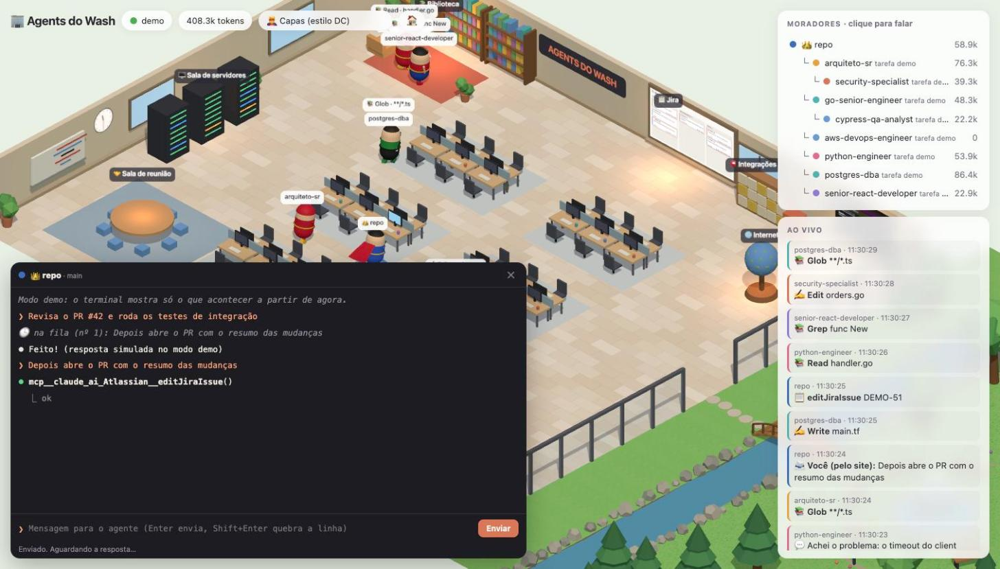
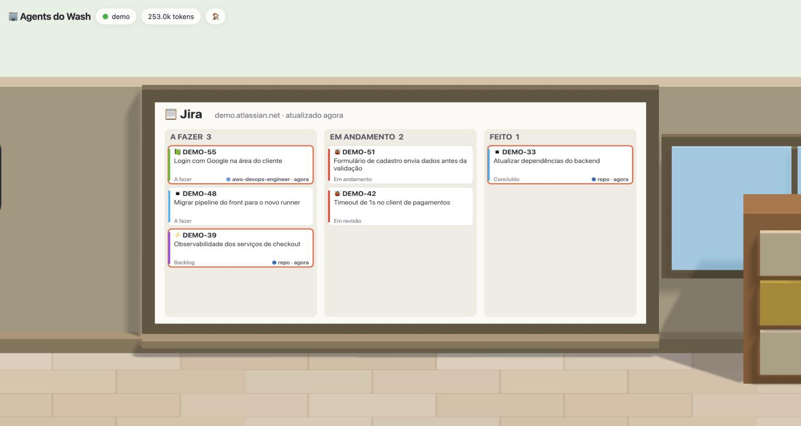
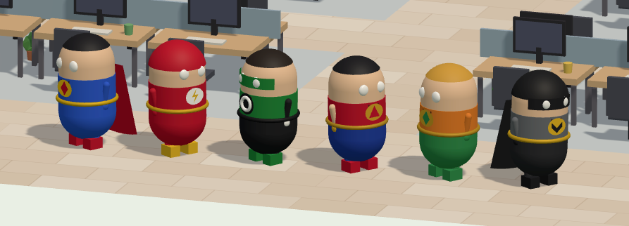
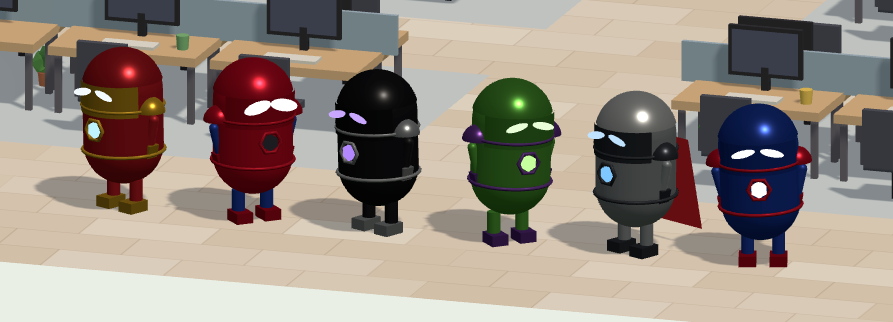
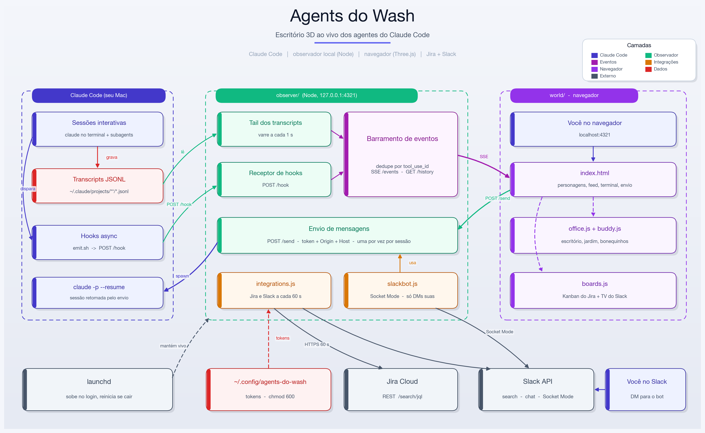

# 🏢 Agents do Wash (POC)

Um escritório 3D com jardim onde seus agentes do Claude Code (bonequinhos amarelos de macacão; o principal usa coroa 👑, os subagents têm macacão na cor do seu tipo) andam pelo cenário conforme trabalham.



| | |
|---|---|
|  |  |
| **Escritório**: cada agente vai até a estação da ferramenta que está usando | **Jardim**: agentes ociosos atravessam a ponte e descansam no chafariz |
|  |  |
| **Terminal**: histórico e ao vivo de cada sessão; mensagens para um agente ocupado entram na fila 🕒 | **Jira**: suas issues, com destaque para as que os agentes mexeram |

### Visuais de heróis

Um seletor no topo troca o visual de todos os agentes. Cada agente sorteia as cores de um herói conhecido; o sorteio muda a cada vez que a página abre.


**🦸 Capas (estilo DC)**: capa que esvoaça ao correr, máscara, cinto e emblema geométrico


**🤖 Armaduras (estilo Marvel)**: visor de lentes, núcleo de energia, ombreiras; escudo e capa em alguns

### Pelo Slack

```
você:  lista
bot:   Agentes rodando (2)

       1. 👑 dev-performance-analyzer `69b2d1a6` · 🟢 trabalhando · ativa agora
             📁 ~/repo/dev-performance-analyzer
             📋 pedido há 10 min: Fechar os dados de setembro e reprocessar os unmatched
             🔧 última ação agora: Bash · Mede o progresso do reprocessamento
             👥 subagents (1):
                   • python-engineer — Telemetria: coletar unmatched · 🟢 · Read telemetry.py

       2. 👑 refinmulnivel `a1b2c3d4` · 🟠 aguardando você · ativa há 1 min
             ❗ Permissão: Bash node replay.cjs

você:  1: roda os testes de novo
bot:   🕒 dev-performance-analyzer está ocupado. Sua mensagem é a nº 1 da fila…
bot:   ✅ dev-performance-analyzer respondeu: Todos os 42 testes passaram.
```

<sub>Prints do modo demo (`/?demo`), com dados fictícios; a conversa do Slack é um exemplo.</sub>

## 🎬 Modo apresentação

Um tour automático, com câmera, legendas e cenas encenadas (no modo demo), para gravar a tela e narrar: abra
**http://localhost:4321/?demo&tour** ou clique em 🎬 no topo. A versão padrão tem **1 minuto** (10 cenas); a completa, em `?demo&tour=completo`, tem 18 cenas e ~4 min 20 s: os agentes, as ferramentas,
os subagentes, os heróis, o chefe, o head de segurança, o CTO, o Limpinho, a copa, o jardim, Jira e Slack, o terminal com fila,
renomear um agente, pedido de permissão, a câmera que segue e o bot do Slack.
Teclas: `→`/`←` cenas, `espaço` pausa, `H` esconde a legenda, `Esc` sai. **`P` abre a tela do apresentador**: uma janela pequena
no canto (ou no outro monitor) com a fala sugerida, o cronômetro e os controles; a legenda some da tela gravada. O roteiro de narração está em
[docs/roteiro-apresentacao.md](docs/roteiro-apresentacao.md).

## Arquitetura



- **Observador**: Node puro, zero dependências, só escuta em `127.0.0.1`. Lê os transcripts e recebe os hooks; a única ação que ele executa é o envio de mensagens (`claude -p --resume`), protegido por token.
- **Duas fontes**: os transcripts JSONL (sempre) e os hooks (opcional, instantâneo). Eventos repetidos são descartados pelo `tool_use_id`.
- **Mundo**: Three.js via CDN, sem build. `world/office.js` monta o cenário; `world/buddy.js`, os bonequinhos com animação procedural (andar, correr, sentar, acenar, pular, dançar…).
- **Visuais**: um seletor no topo troca o visual dos agentes: 🟡 Clássico (cápsula de macacão), 🦸 Capas (estilo DC: capa esvoaçante, máscara, emblema geométrico) e 🤖 Armaduras (estilo Marvel: visor, núcleo de energia, ombreiras). Cada agente sorteia as **cores** de um herói conhecido (Capas: Superman, Batman, Flash, Lanterna Verde, Mulher-Maravilha, Aquaman; Armaduras: Homem de Ferro, Capitão América, Homem-Aranha, Pantera Negra, Hulk, Thor), sorteadas para cada agente (inclusive o principal), sem repetir até todos os heróis saírem. Só as cores são inspiradas: os bonequinhos, emblemas e formas são originais, sem nomes, símbolos ou uniformes oficiais.
- **Cenário**: escritório com 36 mesas em 6 ilhas, biblioteca, sala de servidores, sala de reunião com quadro, copa, relógio com a hora real. Pela porta de vidro sai-se para o jardim: riacho, ponte em arco, chafariz com bancos, árvores e flores.

## Rodar

```sh
./start.sh                         # sobe em http://localhost:4321 e abre o navegador
open http://localhost:4321/?demo   # modo demo, sem precisar de sessão ativa
./install-launchd.sh               # opcional: sempre ligado no login do macOS
```

Variáveis: `PORT` (4321), `ACTIVE_MIN` (30: só mostra sessões tocadas nos últimos N min), `CLAUDE_PROJECTS`.

## Hooks (tempo real)

```sh
node hooks/install.js              # adiciona hooks async em ~/.claude/settings.json (faz backup)
node hooks/install.js --uninstall  # remove só os hooks do Agents do Wash
```

Os hooks são `async` e o `emit.sh` sempre sai com 0. Se o observador estiver desligado, nada trava.
Com hooks ativos, o status mostra **ao vivo ⚡ hooks**. Os últimos payloads ficam em http://localhost:4321/debug.

| Hook | No mundo |
|---|---|
| `PreToolUse` | vai até a estação na hora (sem esperar o JSONL) |
| `PostToolUse` com erro | balança a cabeça (`No`) e mostra ❌ |
| `Notification` / `PermissionRequest` | pula e fica acenando com um balão vermelho ❗ até você responder |
| `Stop` | 👍 e volta a sentar na mesa |
| `SubagentStop` / `SessionEnd` | acena 👋 e sai pela porta |
| `UserPromptSubmit` | balão 🧑 com seu prompt |

## Terminal no site

Clique num bonequinho (ou no nome dele na lista) para abrir o terminal da sessão dele: o histórico
(`GET /history`, até as últimas 400 entradas) e, ao vivo, cada prompt `❯`, resposta `⏺`, ferramenta `⏺ Nome(args)`
e saída `⎿` (saídas longas começam recolhidas; clique para expandir). Esc fecha.

## Identidade de cada agente

Quando um agente aparece pela primeira vez, ele **escolhe um nome** (ex.: "Bia Byte", "Zeca Kernel") e **um estilo de roupa**
(clássico, capa ou armadura, com um herói sorteado) e se apresenta num balão. A escolha fica salva no servidor em
`~/.config/agents-do-wash/identities.json`, então recarregar a página ou reiniciar o observador mantém nome e roupa
(agentes que não aparecem há 14 dias são esquecidos). O papel dele (projeto ou tipo) aparece em letra miúda ao lado do nome.
No seletor do topo, **🎲 Cada um no seu estilo** usa a roupa escolhida por cada agente; as outras opções forçam um visual para todos.

## O chefe 👔

Um personagem mais forte, de camisa social azul-clara, patrulha o escritório e dá broncas bem-humoradas, de preferência em
quem está no chafariz, na copa ou acabou de errar ("Ô Bia, chafariz é na hora do almoço!", "De novo no café?"). Quem leva bronca leva um susto,
responde ("Já vou, chefe!") e, se estava no chafariz, volta para a mesa. É só visual: não é uma sessão do Claude e não gasta token.
O botão 👔 no topo liga e desliga.

## O head de segurança 🛡️

Barba cheia, jaqueta puffer preta e distintivo no peito: circula pelo escritório dando dicas de segurança de acordo com
o que cada agente está fazendo. Quem está pedindo permissão ouve "Lê com calma antes de aprovar!", quem está no terminal
ouve "Cuidado com rm -rf!", quem está na web ouve "Confere o domínio antes de clicar!", e os demais recebem dicas gerais
("Esse .env não vai pro git, né?", "Rotacionou aquela chave de API?"). Também solta dicas para o time todo. Às vezes exagera no jargão ("Isso tá vulnerável a TOCTOU com race no inode!"), o agente responde "Hã? Não entendi nada!" e ele traduz: "Resumindo: confere o arquivo na hora de usar 🙄".
O agente concorda e responde ("Anotado!"). Também é só visual, sem custo de token; o botão 🛡️ no topo liga e desliga.

## O CTO 💪

Bem musculoso e grisalho, de regata, shorts, faixa na testa, munhequeira, tênis neon e coqueteleira de whey. Dá bronca em todo mundo:
nos agentes ("Bora, Bia! Mais uma série de testes!"), no chefe ("Chefe, menos bronca e mais entrega!"), no head de segurança
("Segurança, fala português com o time!") e até no robô de limpeza. Quem leva bronca para, ouve e responde
("Sim, chefe do chefe!", "Ok, ok… em português!"). O botão 💪 no topo liga e desliga.

## O robô de limpeza 🤖

O Limpinho (robô de metal claro, tela no rosto, antena e esfregão) passa pano pelo escritório, pela copa, pela sala de
reunião, pela biblioteca e pela praça do chafariz, deixando uma placa de "piso molhado" onde limpa. Se tem alguém perto,
pede licença ("Levanta o pé, Bia!"); na copa reclama do café derramado. O botão 🤖 no topo liga e desliga.

## Navegar e dar zoom

- **Rodinha do mouse**: aproxima para onde o cursor aponta.
- **Duplo clique** num ponto: a câmera voa até lá, já aproximada.
- **📍 Ir para…**: atalhos para copa, chafariz, sala de reunião, biblioteca, servidores, quadro do Jira/TV do Slack, mesas e jardim.
- **➕ ➖** no topo (ou as teclas `+` e `-`); **🏠** volta à visão geral.
- **🎥** no terminal de um agente: a câmera segue o agente por onde ele for (arrastar a câmera cancela).

## Dar nomes aos agentes

No terminal de qualquer agente, clique em ✏️ ao lado do nome, digite e aperte Enter (vazio volta ao nome original).
No Slack: `renomear 2 Time de Dados`. O apelido (que vale mais que o nome escolhido pelo agente) vale no site, no Slack e no feed, aparece em cima do bonequinho,
e fica salvo em `~/.config/agents-do-wash/aliases.json`, sobrevivendo a reinícios. A lista de moradores mostra
o nome original em letra miúda ao lado do apelido.

## Falar com um agente pelo site

No terminal de uma sessão principal, escreva no `❯` e aperte Enter. O servidor roda
`claude -p --resume <sessão> "<mensagem>"` no diretório da sessão; a conversa continua na **mesma** sessão,
então a resposta aparece no transcript, no feed e no bonequinho.

- Só sessões principais 👑. Subagents recebem tarefas de quem os criou; a caixa oferece falar com o agente principal.
- **Fila**: se o agente está ocupado (respondendo outra mensagem, ou trabalhando no terminal), a mensagem entra na fila e é entregue quando ele termina (hook `Stop`, ou 60 s sem atividade). Até 20 por sessão.
- **Permissões**: a sessão é retomada no mesmo modo de permissão em que estava (ex.: `auto`). Como não há terminal para aprovar, o que ainda pedisse aprovação nesse modo é negado.
- Uma sessão aberta num terminal não vê as mensagens enviadas por aqui até ser retomada (`claude --resume`).
- Um envio por vez por sessão; tempo máximo de 30 min.
- **Segurança**: o `POST /send` exige um token aleatório gerado a cada subida do servidor (injetado na página), `Origin` e `Host` locais e `Content-Type: application/json`. Outros sites abertos no navegador não conseguem enviar.
- Binário: `CLAUDE_BIN` ou o primeiro `claude` encontrado em `~/.local/bin`, `/opt/homebrew/bin`, `/usr/local/bin` ou `PATH`.

## Jira e Slack ao vivo

Na parede do fundo há um **quadro Kanban do Jira** e uma **TV do Slack**, atualizados a cada 60 s pelo observador.
Clique num deles para a câmera ficar de frente; com ela de frente, clique num card ou mensagem para abrir. 🏠 volta à visão geral.

- **Jira**: suas issues (`assignee = currentUser()`, abertas ou mexidas nos últimos 7 dias) e as que algum agente tocou nas últimas 24 h.
  O card que um agente acabou de mexer fica destacado, com o nome dele. Agentes usando ferramentas do Jira vão até o quadro.
- **Slack**: as mensagens mais recentes da busca `to:me` (configurável). Mensagens novas acendem a TV e entram no feed.

As credenciais ficam **só no servidor**, em arquivos com permissão 600 (não vão para o navegador nem para o log).
Crie-os num terminal (o `read -s` não mostra o que você digita):

```sh
mkdir -p ~/.config/agents-do-wash && cd ~/.config/agents-do-wash

# Jira: token em https://id.atlassian.com/manage-profile/security/api-tokens
read -s "T?Jira API token: " && printf '{"site":"SEU-SITE.atlassian.net","email":"SEU-EMAIL","token":"%s"}\n' "$T" > jira.json && chmod 600 jira.json; unset T

# Slack: token de USUÁRIO (xoxp-) de um app seu com o escopo search:read
read -s "T?Slack user token: " && printf '{"token":"%s","query":"to:me"}\n' "$T" > slack.json && chmod 600 slack.json; unset T
```

Opcionais: `"jql"` no `jira.json` e `"query"` no `slack.json` (sintaxe de busca do Slack). Variáveis de ambiente
`JIRA_SITE`, `JIRA_EMAIL`, `JIRA_API_TOKEN`, `JIRA_JQL`, `SLACK_TOKEN` e `SLACK_QUERY` têm prioridade.
Não precisa reiniciar: o observador relê os arquivos a cada consulta. Erros (token recusado, escopo faltando) aparecem no próprio quadro/TV.

## Falar com os agentes pelo Slack

Mande DM para o bot **Agents do Wash** no Slack:

| Você escreve | O que acontece |
|---|---|
| `lista` | agentes rodando, numerados: status (🟢 trabalhando, 🟠 aguardando você, ⏳ respondendo, ⚪ parado), pasta, o que foi pedido, a última ação, a última fala e os subagents |
| `contexto 2` (ou `contexto nome`) | as últimas ações daquela sessão, no estilo do terminal |
| `renomear 2 Time de Dados` | dá um nome para a sessão (`renomear 2` sem nome volta ao original) |
| `ems: roda os testes` (ou `Time de Dados: …`, `@ems …`, `2: …`) | envia para essa sessão (`claude -p --resume`) |
| texto sem nome | vai para a última sessão com que você falou pelo Slack (ou a mais recente) |
| `ajuda` | mostra os comandos |

A resposta do agente chega na mesma thread, e o bonequinho reage no escritório.

**Segurança:** o bot só aceita **DMs de um único usuário** (`allowedUser`, você), do mesmo workspace do bot.
Canais, outras pessoas, outros bots, edições e eventos repetidos são ignorados. A conexão é por Socket Mode (sai do
seu Mac; não há URL pública). Vale tudo das regras do envio pelo site (só sessões principais, fila, mesmo modo de permissão).

**Instalação** (uma vez):
1. Em https://api.slack.com/apps → *Create New App* → *From a manifest* → escolha o workspace e cole `slack-app-manifest.yml`.
2. *Install to Workspace*. Em *OAuth & Permissions*, copie o **Bot User OAuth Token** (`xoxb-`) e o **User OAuth Token** (`xoxp-`).
3. Em *Basic Information → App-Level Tokens*, gere um token com o escopo `connections:write` (`xapp-`).
4. No seu terminal:

```sh
cd ~/.config/agents-do-wash
read -s "B?Bot token (xoxb-): " && echo && read -s "A?App token (xapp-): " && echo && \
  printf '{"botToken":"%s","appToken":"%s"}\n' "$B" "$A" > slackbot.json && chmod 600 slackbot.json; unset B A
# o token de usuário (xoxp-) deste app também serve para a TV do Slack:
read -s "T?User token (xoxp-): " && printf '{"token":"%s","query":"to:me"}\n' "$T" > slack.json && chmod 600 slack.json; unset T
```

O bot descobre o seu ID pelo token de usuário (`slack.json`, mesmo workspace). Para fixar manualmente, adicione
`"allowedUser": "U…"` ao `slackbot.json` (Slack → seu perfil → ⋮ → *Copiar ID de membro*). O observador tenta conectar
a cada minuto; quando conectar, aparece **🤖 Slack bot ligado** no topo do site.

## O que cada ferramenta faz no mundo

| Ferramenta | Lugar | Gesto ao chegar |
|---|---|---|
| Read, Grep, Glob | 📚 Biblioteca | Yes |
| Bash, Monitor | 🖥️ Terminal | Punch |
| WebFetch, WebSearch, Chrome | 🌐 Internet | ThumbsUp |
| Agent, SendMessage, Workflow | 🤝 Sala de reunião | Wave |
| Ferramentas do Jira (`mcp__…Atlassian__*`) | 📋 Quadro do Jira | Yes |
| Ferramentas do Slack (`mcp__…Slack__*`) | 💬 TV do Slack | Wave |
| Outros `mcp__*` (Gmail, Drive…) | 📮 Integrações | Yes |
| Edit, Write e o resto | ✍️ A própria mesa | senta e digita |

Todos (agentes e chefe) desviam de mesas, estantes, paredes, riacho, chafariz e árvores: o mapa vira uma grade de obstáculos e cada deslocamento é calculado com A\*, atravessando o riacho só pela ponte. Longe do destino, o bonequinho corre; perto, anda. Sem atividade por 45 s, ele sorteia o que fazer à toa: ☕ café na copa (com caneca, goles e papo), 🪑 ficar na mesa, 📚 ler na biblioteca, 🤝 bater papo na sala de reunião ou ⛲ descansar no chafariz; depois de 40–90 s troca de atividade. Ao terminar o turno (`Stop`), dança na mesa. Depois de 30 min, sai do escritório.
Na lista de moradores, cada subagent aparece abaixo de quem o criou.
